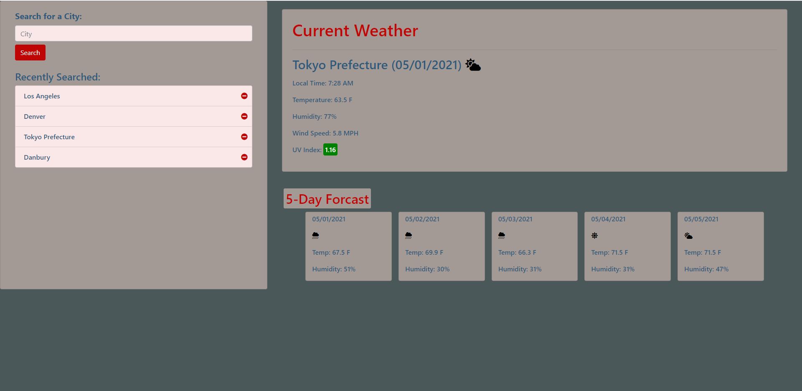

# Weather Dashboard

## Description
This dashboard allows you to search the weather of any major city in the world. The dashboard displays the current weather of tthat location and shows the daily forcast for the current day and the next 4. This page utalizes the openweathermap api.
# Features
## Weather Display
The main display shows the current weather and the dialy weather forcast for the current day and the next 4. The uv Index is displayed nad is color coded based on its sevarity. The current weather also displays the local date and time of the searched location. The dashboard incorperated icons depending on the weather discrition provided by the api. 
## Previous Searches
The site provides the user with a list of their 10 most recent searches. The recently searched section updates dynamically as searches are made and persists between browser sessions. The user also has the option to remove any item in the recently searched list. 
## No City Found Alert
THe site also accounts for searches that yield no results form the api and informs the user that the city they searched has garnered no results.
